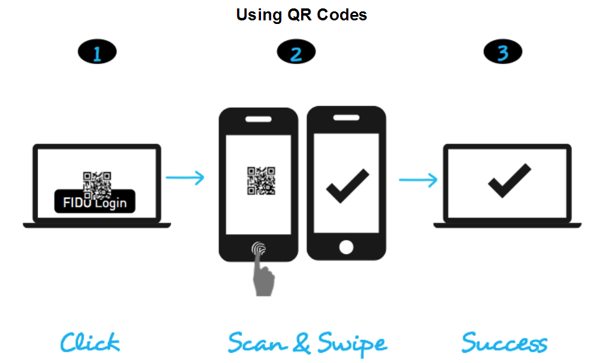

# FIDO UAF Authenticator

The UAF allows applications to take advantage of the security capabilities of modern devices such as fingerprint 
biometrics, iris recognition, voice biometrics and others. It provides a unified infrastructure that allows you to integrate these capabilities in a simple manner to enable authentication that is both more user friendly and more secure than password

## Typical UAF architecture

This is generic diagram which provides UAF architecture overview. There are 2 parts. One part contains components that resides on the user’s device. Another part is RP and UAF server. The typical gateway between these 2 parts is mobile browser with UAF plugin. The RP should provides proxy capabilities to deliver messages from mobile browser plugin to UAF server.

It's not very convinient when RP is an second device. Non Nok offer OOB API which simplify UAF integration in this case.   

## Out-of-Band Authentication 
Out-of-Band (OOB) authentication allows your users to employ your mobile app to authenticate 
with UAF even on devices that do not have any UAF components installed. In this form of 
authentication typically, the user of a laptop authenticates to a web application using their 
mobile device. The user binds the browser session to his or her mobile device by scanning a 
QR code using the mobile device or by triggering a push notification. The user then performs 
the UAF authentication on an out-of-band channel between the mobile device and the Nok Nok 
Authentication Server. Once the user authenticates successfully, the Authentication Server 
notifies your application server. OOB is a proprietary feature developed by Nok Nok Labs on top 
of the FIDO UAF protocol. 

Also it allows to use platform push notification messages.

## Device integration models

This is not part of UAF authentication script but shows modular architecture of UAF mobile authentication part.

Some devices will feature a preloaded UAF Client and one or more UAF ASMs. In some cases, 
devices may only feature a preloaded UAF ASM, rather than both a UAF Client and ASM. Older 
legacy devices may feature neither a UAF Client nor a UAF ASM. Nevertheless the App SDK 
can support each of these three scenarios illustrated below from the same mobile application. 

## Integration with oxAuth

The integrations with oxAuth has been done via Person Authentication module. This  workflow shows communication process between components.

## Person authentication module activation

This module is part of CE. It has only one mandatory property "uaf_server_uri". There are more information about module configuration in "Installation.md" and "Properties description.md"

Nok Nok SDK contains sample application which allows to test script. In the SDK there are binaries and source code of this application.
